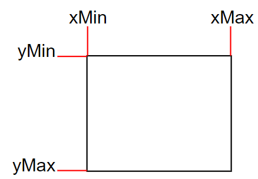

### 自定义Inspector   修饰CustomEditor(typeof(目标类))
``` csharp
//c# 示例 (LookAtPointEditor.cs)
using UnityEngine;
using UnityEditor;

[CustomEditor(typeof(LookAtPoint))]
[CanEditMultipleObjects]
public class LookAtPointEditor : Editor 
{
    SerializedProperty lookAtPoint;
    
    void OnEnable()
    {
        lookAtPoint = serializedObject.FindProperty("lookAtPoint");
    }

    public override void OnInspectorGUI()
    {
        serializedObject.Update();
        EditorGUILayout.PropertyField(lookAtPoint);
        serializedObject.ApplyModifiedProperties();
    }
}
```

### API

```csharp
// 空行，高度为一行的高度
GUILayout.Space(EditorGUIUtility.singleLineHeight)
// 设置label宽度，对之后的所有物体都生效，所以一般在对的下一行的物体应用后再设置回之前的宽度
EditorGUIUtility.labelWidth = 300f;
GUILayout.Button
EditorGUILayout.Toggle
EditorGUILayout.ToggleLeft
EditorGUILayout.Popup
EditorGUILayout.TextField
// 多选时，如果Property有不同的值，是否显示mixValue符号
EditorGUI.showMixedValue
// 默认label的gui样式
GUIStyle style = GUI.skin.label;
```

### CustomShaderGUI

```csharp
public class CustomLitGUI : ShaderGUI
{
    public override void OnGUI(MaterialEditor materialEditor, MaterialProperty[] properties)
    {
        var property = FindProperty(propertyName, properties);
        // 如果选中了多个材质，材质上的对应属性可能有不同的值
        // editor.ShaderProperty会自动处理这些，但是如果用EditorGUI等绘制则需要手动处理
        EditorGUI.showMixedValue = property.hasMixedValue;
        // EditorGUILayout 或 EditorGUI 来绘制属性
        // 绘制完毕后记得重置
        EditorGUI.showMixedValue = false;
    }
```

### 自定义ProjectSettings或Preferences选项SettingsProvider

``` csharp
class CustomSettingProvider : SettingsProvider
{
    public BordlessFrameworkSettingProvider(string path, SettingsScope scopes = SettingsScope.Project) : base(path, scopes) { }

    [SettingsProvider]
    private static SettingsProvider ShowSettingsProvider()
    {
        return new CustomSettingProvider($"CustomSetting/Log Switch");
    }
}
```


https://docs.unity3d.com/2019.4/Documentation/ScriptReference/SettingsProvider.html

### Rect

两种表示方法

-   x y表示（屏幕坐标下的）位置，width height表示宽高
    
-   xMin yMin xMax yMax表示（屏幕坐标下的）边界
    