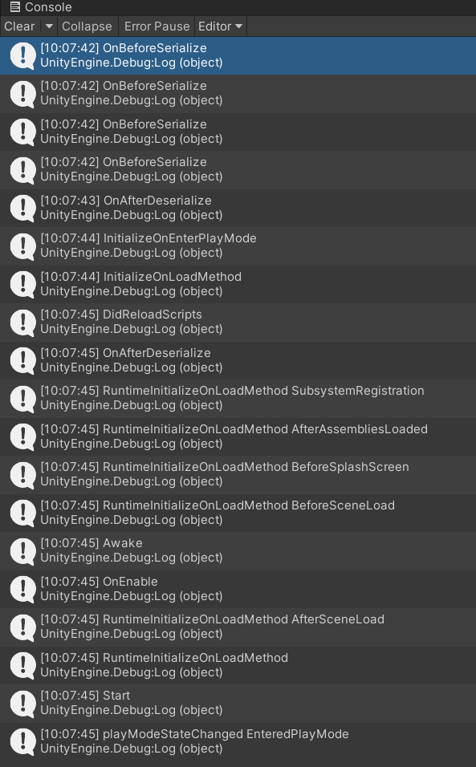

### 开启了Enter Play Mode Option 可能导致的问题

不勾选Reload Domain，那么每次进入Play Mode时，并不会销毁Domain，这会导致

-   静态函数只会在第一次进入PlayMode时被调用
-   静态变量不会被“重置”


#### 分析

- 默认情况下Unity编辑器是开启了Reload Domain，每次进入播放模式时，就会重置所有静态字段和已经注册的处理程序（加载了的静态类也会被销毁）。
- 静态构造函数仅调用一次，在程序驻留的应用程序域的生存期内，静态类一直保留在内存中。
- 静态成员在第一次被访问之前并且在调用静态构造函数（如有存在）之前进行初始化，此后一直保持在内存中，直到应用程序域的生命周期结束。

虽然Unity编辑器没有关闭，但是如果关闭了Reload Domain，在编辑器运行一次之后
- 如果某个静态构造函数被调用过了，那么直到退出编辑器之前，这个静态构造函数不会再被调用
- 如果某个静态成员被初始化了，那么直到退出编辑器之前，这个静态成员不会再被初始化

### 各种初始化函数的调用时机

#### OnBeforeSerialize 和 OnAfterSerialize 的调用时机不确定

```[InitializeOnLoad]```：Allows you to initialize an Editor class when Unity loads, and when your scripts are recompiled.

[DidReloadScripts]：代码被reload之后的回调

#### 能明确调用顺序的部分

-   [**InitializeOnEnterPlayMode**]标签标识的函数：进入Play Mode时调用
-   [**InitializeOnLoadMethod**]标签标识的函数：编辑器下，启动编辑器后或编译代码后都会被调用，关闭Enter Play Mode Option，或启用ReloadDomain时，每次进入Play Mode都会被调用，猜测是ReloadDomain时调用了。
-   RuntimeInitializeOnLoadMethod SubsystemRegistration
-   RuntimeInitializeOnLoadMethod AfterAssembliesLoaded
-   RuntimeInitializeOnLoadMethod BeforeSplashScreen
-   RuntimeInitializeOnLoadMethod BeforeSceneLoaded
-   Awake
-   OnEnable
-   RuntimeInitializeOnLoadMethod AfterSceneLoaded，也是RuntimeInitializeOnLoadMethod的默认值
-   Update





``` csharp
using UnityEditor;
using UnityEditor.Callbacks;
using UnityEngine;

public class InitTest : MonoBehaviour, ISerializationCallbackReceiver
{
    // ensure class initializer is called whenever scripts recompile
    [InitializeOnLoad]
    public static class PlayModeStateChangedExample
    {
        // register an event handler when the class is initialized
        static PlayModeStateChangedExample()
        {
            EditorApplication.playModeStateChanged += LogPlayModeState;
        }

        private static void LogPlayModeState(PlayModeStateChange state)
        {
            Debug.Log($"{nameof(EditorApplication.playModeStateChanged)} {state}");
        }
    }

    [InitializeOnEnterPlayMode]
    private static void InitializeOnEnterPlayMode() { Debug.Log(nameof(InitializeOnEnterPlayMode)); }

    [InitializeOnLoadMethod]
    private static void InitializeOnLoadMethod() { Debug.Log(nameof(InitializeOnLoadMethod)); }

    [DidReloadScripts]
    private static void DidReloadScripts() { Debug.Log(nameof(DidReloadScripts)); }

    public void OnBeforeSerialize() { Debug.Log(nameof(OnBeforeSerialize)); }

    public void OnAfterDeserialize() { Debug.Log(nameof(OnAfterDeserialize)); }

    [RuntimeInitializeOnLoadMethod(RuntimeInitializeLoadType.SubsystemRegistration)]
    private static void SubsystemRegistration() { Debug.Log($"RuntimeInitializeOnLoadMethod {nameof(RuntimeInitializeLoadType.SubsystemRegistration)}"); }

    [RuntimeInitializeOnLoadMethod(RuntimeInitializeLoadType.AfterAssembliesLoaded)]
    private static void AfterAssembliesLoaded() { Debug.Log($"RuntimeInitializeOnLoadMethod {nameof(RuntimeInitializeLoadType.AfterAssembliesLoaded)}"); }

    [RuntimeInitializeOnLoadMethod(RuntimeInitializeLoadType.BeforeSplashScreen)]
    private static void BeforeSplashScreen() { Debug.Log($"RuntimeInitializeOnLoadMethod {nameof(RuntimeInitializeLoadType.BeforeSplashScreen)}"); }

    [RuntimeInitializeOnLoadMethod(RuntimeInitializeLoadType.BeforeSceneLoad)]
    private static void BeforeSceneLoad() { Debug.Log($"RuntimeInitializeOnLoadMethod {nameof(RuntimeInitializeLoadType.BeforeSceneLoad)}"); }

    [RuntimeInitializeOnLoadMethod(RuntimeInitializeLoadType.AfterSceneLoad)]
    private static void AfterSceneLoad() { Debug.Log($"RuntimeInitializeOnLoadMethod {nameof(RuntimeInitializeLoadType.AfterSceneLoad)}"); }

    [RuntimeInitializeOnLoadMethod]
    private static void RuntimeInitializeOnLoadMethod() { Debug.Log($"{nameof(RuntimeInitializeOnLoadMethod)}"); }

    private void Awake() { Debug.Log(nameof(Awake)); }

    private void Start() { Debug.Log(nameof(Start)); }

    private void OnEnable() { Debug.Log(nameof(OnEnable)); }

}

```

### 参考

-   https://docs.unity3d.com/ScriptReference/InitializeOnLoadAttribute.html
-   https://docs.unity3d.com/Manual/RunningEditorCodeOnLaunch.html
-   https://docs.unity3d.com/ScriptReference/RuntimeInitializeOnLoadMethodAttribute.html
-    https://caitsithware.com/wordpress/archives/2263