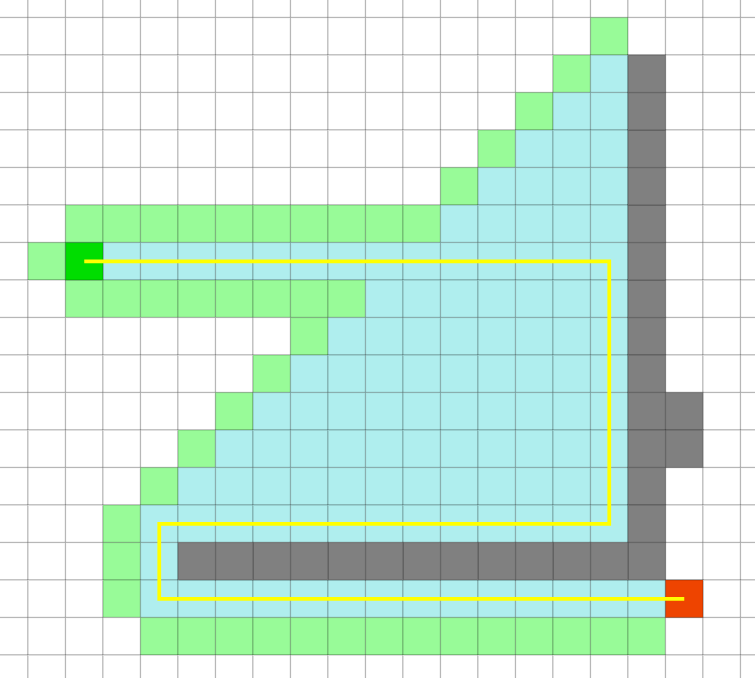

### 关键

- 基于广度优先搜索
- 评价函数+优先队列，优先访问cost较小的节点

### 缺点

- 评价函数一般为$cost=f(distance_{node, destination})$，和当前节点到终点的距离成正比，如果有障碍物，**找到的路径很可能不是最短路径**（如下图，碰到障碍物之后绕行，没有考虑对角线方向移动等）

    

- 没有考虑起点和终点到当前节点已花费的代价，代价仅由启发函数组成。

### 伪代码

```
初始化 OpenList ClosedList
将起点加入到OpenList
while OpenList is not empty
	从OpenList中取得cost最小的节点作为当前节点，访问其后继节点们
	foreach 后继节点 in 后继节点们
		if 后继节点未访问（不在OpenList或ClosedList中） 评价函数计算cost，设置父节点为当前节点，将后继节点放入到OpenList中
		else if 路径总cost
```

