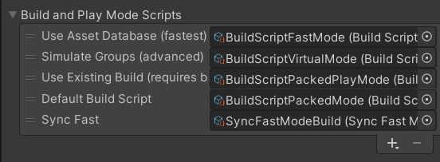

### AddressableAssetSettings



-   Build and Play Mode Scripts
    -   Use Asset Database：直接使用AssetDatabase读取，速度最快，仅编辑器模式下可用
    -   Simulate Groups：创建虚拟的AB包进行测试，**可使用Event Viewer测试加载情况**。仅编辑器模式下可用
    -   Use Existing Build：读取Build好的包，**可使用Event Viewer测试加载情况**。仅编辑器模式下可用
    -   Default Build Script：仅用于Build，显示在Build -> New Build -> Default Build Script，不会显示在Play Mode Script选项中
-   Asset Group Templates：Group的模板，Default Local Group就是用它生成的

### Profiles

#### Default配置

用格式化字符串表示的Path，Group的 Build Path 和 Load Path 选项仅能从这些Path中选择

-   BuildTarget：当前激活的BuildTarget，一般不改
-   LocalBuildPath：指示Build时bundle的位置，一般不改
-   LocalLoadPath：指示加载bundle的位置，一般不改
-   RemoteBuildPath：指示服务器Build时bundle的位置
-   RemoteLoadPath：指示加载bundle的位置

### Catalog


### Group

一个Group下有很多Entry，每个Entry包含一个文件或一个文件夹的asset以及对应address等必要属性

#### Built In Data

-   Include Resources Folders：是否将Resouces文件夹内的资源包含进这个bundle里
-   Include Build Settings Scenes：是否将Build Setting界面下设置的Scenes包含进这个bundle里

#### Default Local Group

-   Include In Build：勾选后，Build的时候会将bundle文件复制到StreammingAssets下
-   Bundle Mode
    -   Pack Together：每个Group中，除了场景之外的资源，打成一个包，场景另外打一个包
    -   Pack Separately：每个Group中的Entry分别打一个包，Entry即Group下的各个目录
    -   Pack Together By Label：相同Label打一个包
-   Internal Id Naming Mode：bundle内的asset的ID命名
-   Bundle Naming：生成的bundle文件的命名
-   Asset Provider：决定如何从bundle中读取asset，要自定义的话可以参考BundledAssetProvider脚本
-   Asset Bundle Provider：决定如何加载bundle，要自定义的话可以参考AssetBundleProvider脚本

### AddressablesBuildScriptHooks

在InitializeOnLoadMethod修饰的函数中```EditorApplication.playModeStateChanged += OnEditorPlayModeChanged```注册了相关事件，编辑器的Play Mode变为Playing时，会执行```settings.ActivePlayModeDataBuilder.BuildData```

BuildScript.buildCompleted：**构建完成回调**，委托在所有执行了构建函数```ActivePlayerDataBuilder.BuildData<AddressablesPlayerBuildResult>(buildContext)```的地方都被执行了

### Build

#### BuildScriptBase

```CanBuildData<T>```

AddressableAssetsSettingsGroupEditor相关GUI绘制代码与此相关，通过CanBuildData返回值决定是否显示在Play Mode Script和Build菜单选项中

``` csharp
var guiMode = new GUIContent("Play Mode Script");
Rect rMode = GUILayoutUtility.GetRect(guiMode, EditorStyles.toolbarDropDown);
if (EditorGUI.DropdownButton(rMode, guiMode, FocusType.Passive, EditorStyles.toolbarDropDown))
{
    var menu = new GenericMenu();
    for (int i = 0; i < settings.DataBuilders.Count; i++)
    {
        var m = settings.GetDataBuilder(i);
        if (m.CanBuildData<AddressablesPlayModeBuildResult>())
            menu.AddItem(new GUIContent(m.Name), i == settings.ActivePlayModeDataBuilderIndex, OnSetActivePlayModeScript, i);
    }
    menu.DropDown(rMode);
}

var guiBuild = new GUIContent("Build");
Rect rBuild = GUILayoutUtility.GetRect(guiBuild, EditorStyles.toolbarDropDown);
if (EditorGUI.DropdownButton(rBuild, guiBuild, FocusType.Passive, EditorStyles.toolbarDropDown))
{
    //GUIUtility.hotControl = 0;
    var menu = new GenericMenu();
    var AddressablesPlayerBuildResultBuilderExists = false;
    for (int i = 0; i < settings.DataBuilders.Count; i++)
    {
        var m = settings.GetDataBuilder(i);
        if (m.CanBuildData<AddressablesPlayerBuildResult>())
        {
            AddressablesPlayerBuildResultBuilderExists = true;
            menu.AddItem(new GUIContent("New Build/" + m.Name), false, OnBuildScript, i);
        }
    }
}
```

-   Use Asset Database，Simulate Groups，Use Existing Build都返回```typeof(T).IsAssignableFrom(typeof(AddressablesPlayModeBuildResult))```因此会显示在Play Mode Script选项中
-   默认只有BuildScriptPackedMode返回```typeof(T).IsAssignableFrom(typeof(AddressablesPlayerBuildResult))```，所以Build菜单里也只有它

#### BuildScriptPackedMode

DoBuild：The method that does the actual building after all the groups have been processed. 如果要自定义Build脚本，建议继承自该脚本，然后override该方法实现自己的build逻辑

``` csharp
// 清理
AddressableAssetSettings.CleanPlayerContent(AddressableAssetSettingsDefaultObject.Settings.ActivePlayerDataBuilder);
// 手动构建
AddressableAssetSettings.BuildPlayerContent();
```

点击Addressables Group面板上的按钮进行构建时，会设置AddressableAssetSettings.ActivePlayerDataBuilder为对应的Build版本，并以此进行Build

### Provider

#### 默认provider

-   AssetDatabaseProvider：直接通过AssetDatabase进行资源读取
-   AssetBundleProvider：决定如何加载bundle
-   BundledAssetProvider：决定如何从bundle中读取asset

#### 自定义provider

-   自定义bundle加载：参考AssetBundleProvider进行修改，然后在自定义的AssetBundleResource类的BeginOperation方法里实现自定义的bundle加载
-   自定义asset加载：参考BundledAssetProvider进行修改

### 异常处理

``` csharp
void Start()
{
    ResourceManager.ExceptionHandler = CustomExceptionHandler;
    //...
}

//Gets called for every error scenario encountered during an operation.
//A common use case for this is having InvalidKeyExceptions fail silently when a location is missing for a given key.
void CustomExceptionHandler(AsyncOperationHandle handle, Exception exception)
{
    if (exception.GetType() != typeof(InvalidKeyException))
        Addressables.LogException(handle, exception);
}
```

参考

-   https://docs.unity3d.com/Packages/com.unity.addressables@1.15/manual/ExceptionHandler.html

### 将event viewer连接到独立播放器

要将事件查看器连接到独立播放器，请进入构建菜单，选择要使用的平台，并确保同时启用了**Development Build**和**Autoconnect Profiler**。接下来，通过选择“**窗口”** >“**分析”** >“**探查**器”来打开Unity Profiler，然后在顶部工具栏上选择要构建的平台。最后，在“构建设置”窗口中选择“**构建并运行**”，事件查看器将自动连接并显示所选独立播放器的事件。